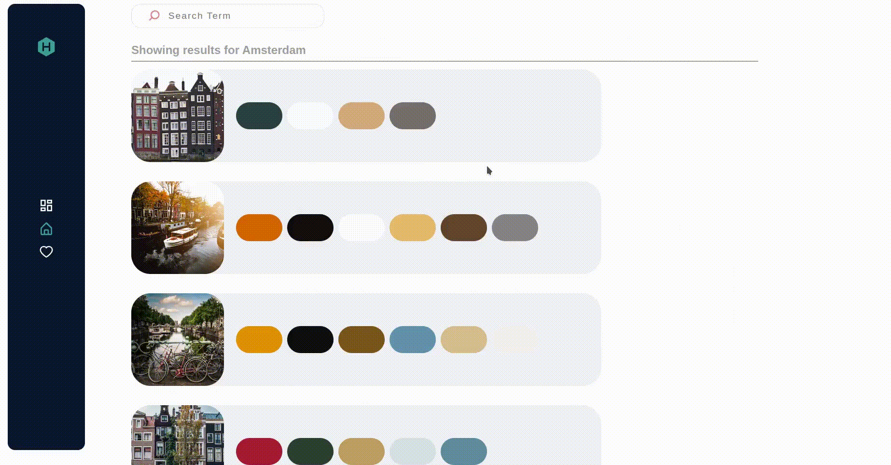
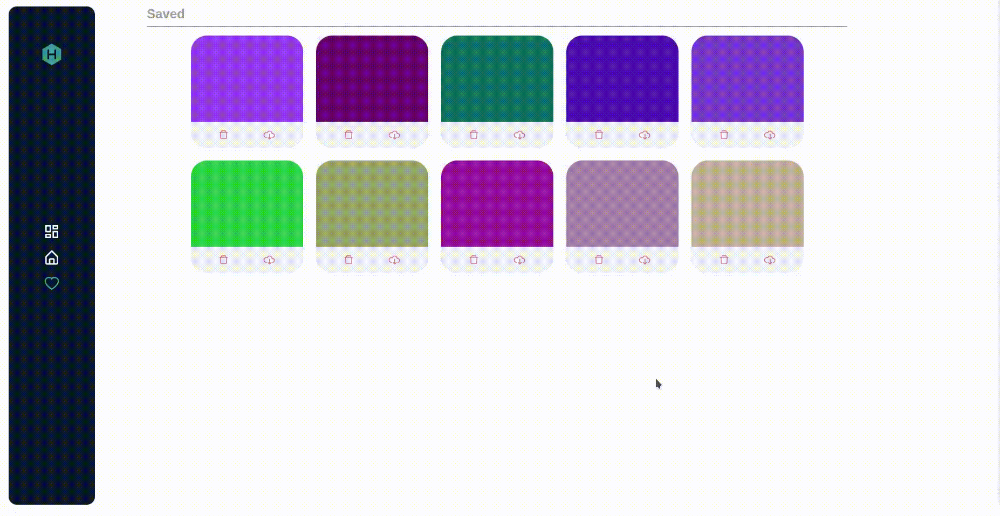

  

    
  

 

  

    Complete Frontend Color Explorer.
  

## 💡 What is hexhub?

Hexhub is meant to be a color explorer for frontend needs. It will save you all the time you use to find a color pallete for your next project.

## ☕️ Features

- Generate color pallets with a single word.
- Option for thousands of colors generated on a scroll.
- Generate multiple shades of a color by name or hex.
- Save colors for future use.

## 🎨 Examples

   
<b>Search Pallets</b>

    

      

        
      

    

   
<b>Explore Colors and Create Multiple Shades</b>

    

      

        
      

    

  
<b>Manage Colors</b>

    

      

        
      

    

  
<b>Responsive Design</b>

    

      

        
      

    

## 🕺 Use Hexhub

<b>Live Link</b>: https://hexhub.ashwincodes.com

## 💻 Development Environment Requirements

1. Nodejs
2. npm
3. Unsplash api key

> **_NOTE:_** Developed and tested on NODE v16.17.0
